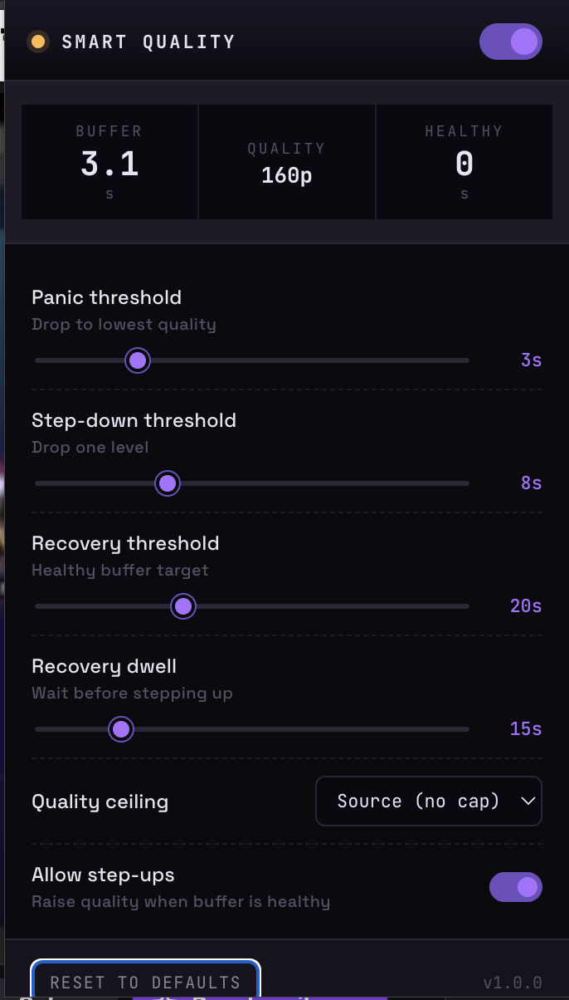

# Twitch Smart Quality

A Chrome extension that replaces Twitch's **Auto** quality setting with a smarter one that prioritizes a smooth stream over resolution.

Twitch's built-in Auto optimizes for quality — it waits too long to step down when your bandwidth dips, so the stream buffers instead of degrading gracefully. This extension watches your video buffer directly and drops quality **before** the stream stutters, then only steps back up after your buffer stays healthy for a sustained window.



---

## Features

- **Proactive quality drops** - steps down one level when the buffer is low, or slams to lowest when it's critical.
- **Sustained recovery** - only steps quality up after the buffer has stayed healthy for a configurable dwell time, so you don't ping-pong.
- **Tunable thresholds** - panic / step-down / recovery targets are all sliders in the popup.
- **Quality ceiling** - cap the max quality (e.g. never go above 720p60) if you're on a metered connection.
- **Live buffer readout** - watch the buffer, current quality, and healthy streak in real time from the popup.
- **Zero network calls** - everything runs locally, no analytics, no remote code.

---

## Installation

Since this isn't on the Chrome Web Store (yet), you install it in developer mode. It's a 30-second process.

### 1. Download the extension

**Option A - Clone the repo:**

```bash
git clone https://github.com/akhilmadipalli/twitch-smart-quality.git
```

**Option B - Download ZIP:**

On this GitHub page, click the green **Code** button -> **Download ZIP**. Extract it somewhere permanent.

### 2. Load it in Chrome

1. Open `chrome://extensions` in your address bar.
2. Toggle **Developer mode** on (top-right corner).
3. Click **Load unpacked**.
4. Select the `twitch-smart-quality` folder (the one containing `manifest.json`).

You should see the extension appear with a purple icon. Pin it to your toolbar for quick access to the popup.

> Also works in **Edge**, **Brave**, **Opera**, **Arc**, and any other Chromium-based browser that supports Manifest V3 extensions. The steps are the same.

### 3. Use it

Open any Twitch stream. The extension takes over automatically - you'll see its log messages in the browser console prefixed with `[TSQ]` if you want to confirm it's running.

Click the extension icon to open the popup and see live stats or tweak thresholds.

---

## How it works

Every second, the extension:

1. Reads the current buffer-ahead from the `<video>` element (how many seconds are loaded past the playhead).
2. Compares it against your thresholds:
   - Buffer **< panic threshold** -> drop to the lowest available quality immediately.
   - Buffer **< step-down threshold** -> drop one level.
   - Buffer **≥ recovery threshold** for **recovery dwell** seconds -> step one level back up (if enabled).
3. Changes quality by briefly interacting with Twitch's own quality menu (hidden from view via a temporary stylesheet, so there's no flicker).

A 4-second cooldown between changes prevents flip-flopping.

---

## Settings

| Setting | Default | What it does |
| --- | --- | --- |
| **Panic threshold** | 3 s | If buffer falls below this, drop to the lowest available quality. |
| **Step-down threshold** | 8 s | If buffer is below this (but above panic), step down one level. |
| **Recovery threshold** | 20 s | Buffer must be at or above this to count as "healthy." |
| **Recovery dwell** | 15 s | Seconds of sustained healthy buffer before stepping up. |
| **Quality ceiling** | Source | Maximum quality the extension will ever select. Useful on metered or shared connections. |
| **Allow step-ups** | On | If disabled, the extension only ever drops quality - it never raises it. |

### Suggested presets

- **"I just want smooth, screw the pixels"** — Panic 5s, Step-down 12s, ceiling 720p, step-ups off.
- **Default balanced** — Panic 3s, Step-down 8s, Recovery 20s, dwell 15s.
- **"I have great internet but occasional blips"** — Panic 2s, Step-down 5s, Recovery 15s, dwell 30s.

---

## Troubleshooting

**The popup shows "reload page" or "not on twitch".**
Make sure you're on a `twitch.tv` tab. If you installed the extension after opening the tab, reload it once.

**Quality isn't changing.**
Open DevTools (F12) on the Twitch tab -> Console. If the extension is working, you'll see `[TSQ]` log lines. If you see errors about missing menu elements, Twitch may have updated their player - please open an issue with your browser version.

**Stream freezes entirely after quality change.**
Let it resume on its own (Twitch's player recovers within a few seconds). If it's persistent, disable the extension and reload, then open an issue.

---

## Known limitations

### Low Latency Mode is not supported
 
When Low Latency Mode is on, Twitch intentionally keeps your buffer pinned at ~1–2 seconds at all times (it micro-adjusts playback speed to maintain this). Because all of this extension's logic is based on buffer depth, a buffer that's always 1s looks like a permanent crisis, which would cause the extension to constantly try to drop quality, even on a perfectly healthy connection.
 
For most casual watching, turning Low Latency off is no big deal. The tradeoff is a much smoother experience on any connection that isn't rock-solid.
 
> **Future roadmap:** Low Latency detection is planned. When enabled, the extension will switch to a different strategy - watching for actual stall events on the video element rather than buffer depth — and will handle both modes automatically.
 
---

- Works only on **desktop Twitch.tv**. Mobile web and embedded players are not supported.
- Relies on Twitch's current player DOM selectors (`data-a-target="player-settings-button"` etc.). If Twitch ships a major player redesign, selectors may need updating - open an issue or PR.
- The extension can only choose from quality tiers Twitch actually offers for the current stream. If a streamer is using "source only" transcodes, you can't drop quality at all - and neither can this extension.
- Changing qualities invokes Twitch's own menu under the hood, which means a new HLS manifest is requested each time. Expect a brief re-buffer of ~0.5–1s on each switch; this is fundamentally unavoidable with the HLS architecture.

---

## Development

Project layout:

```
twitch-smart-quality/
├── manifest.json        # Extension manifest (MV3)
├── content.js           # Isolated-world script: storage bridge + injector
├── injected.js          # Page-context script: buffer monitor + ABR logic
├── popup.html           # Popup UI markup
├── popup.css            # Popup styles
├── popup.js             # Popup behavior + live stats
└── icons/               # Extension icons
```

To iterate: edit files, then hit the circular reload button on the extension card at `chrome://extensions`. Reload any open Twitch tabs to pick up the new content script.

For debugging the page-context logic, open DevTools on a Twitch tab and filter the console for `[TSQ]`.

---

## Privacy

This extension makes **no network requests**. It doesn't talk to any server. All logic runs locally in your browser. Settings are stored in `chrome.storage.local`, which never syncs or leaves your machine.

---

## Contributing

Issues and PRs welcome. Particularly useful:

- Reports of Twitch player DOM changes that break the selectors.
- New preset suggestions.
- Support for Twitch's theater / full-screen / popout modes (should already work but hasn't been stress-tested).

---

## License

MIT. See `LICENSE` if included, otherwise treat as MIT.

---

## Disclaimer

Not affiliated with Twitch or Amazon. "Twitch" is a trademark of its respective owners. This is an independent tool that modifies client-side playback behavior only; it doesn't circumvent any DRM, ads, or subscription gating.
